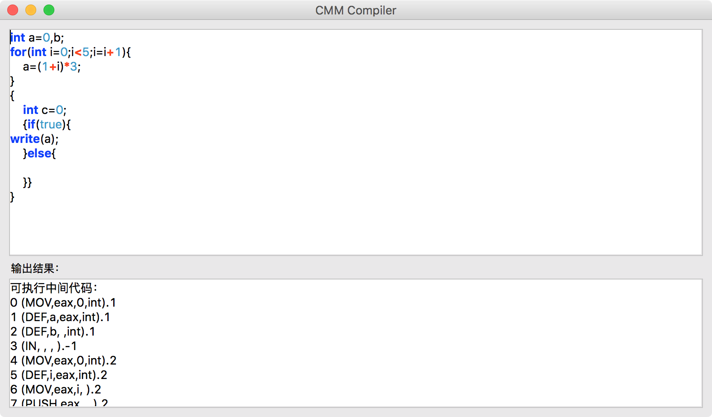
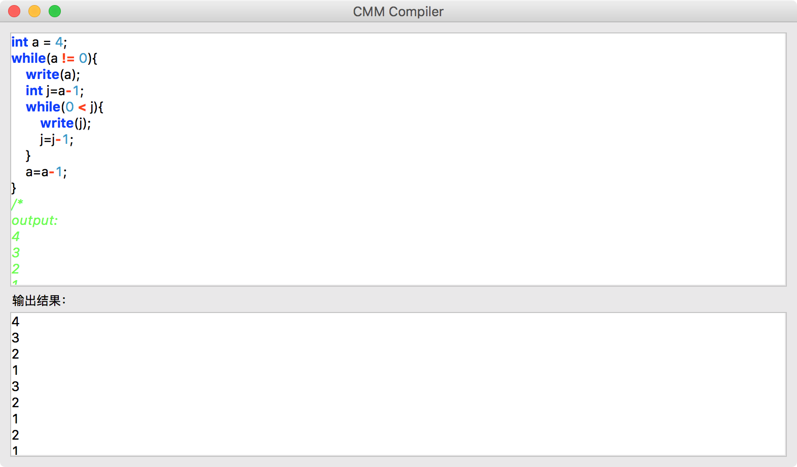
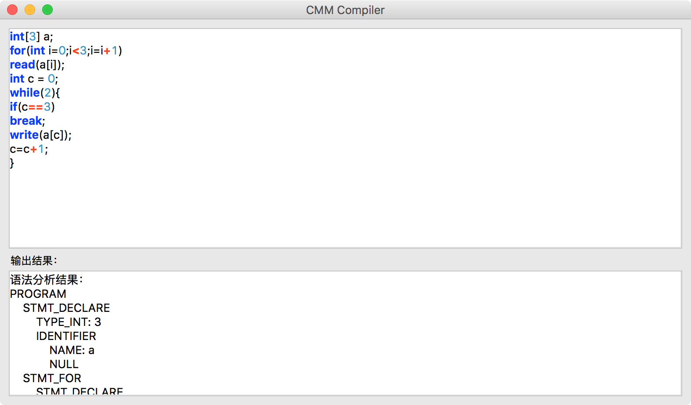
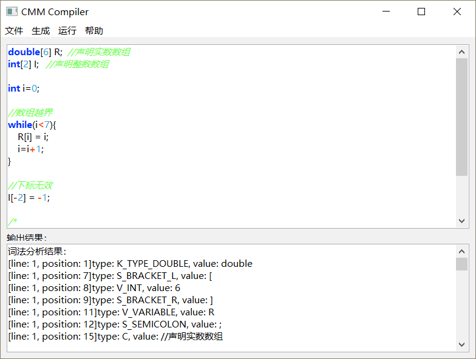
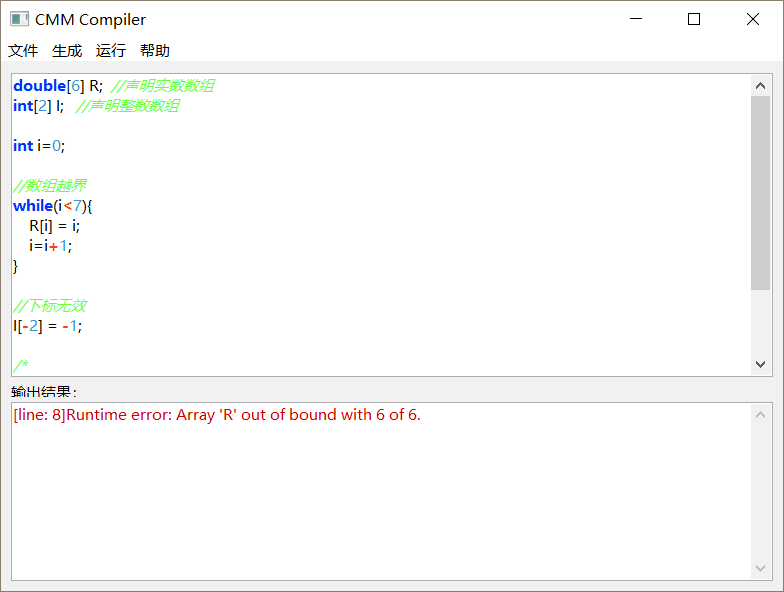
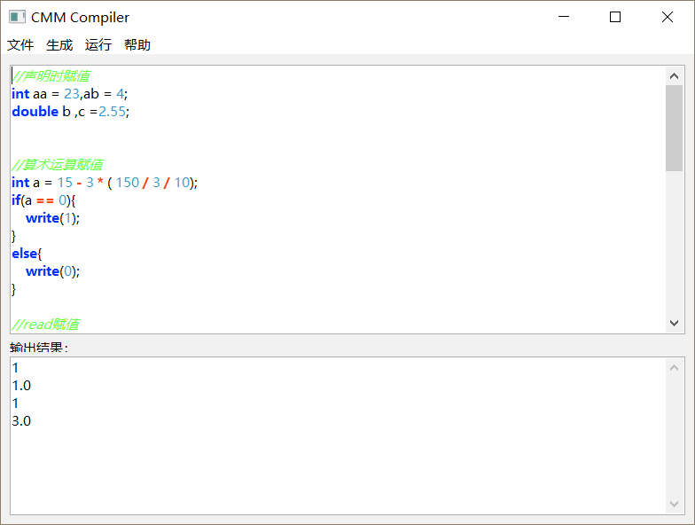
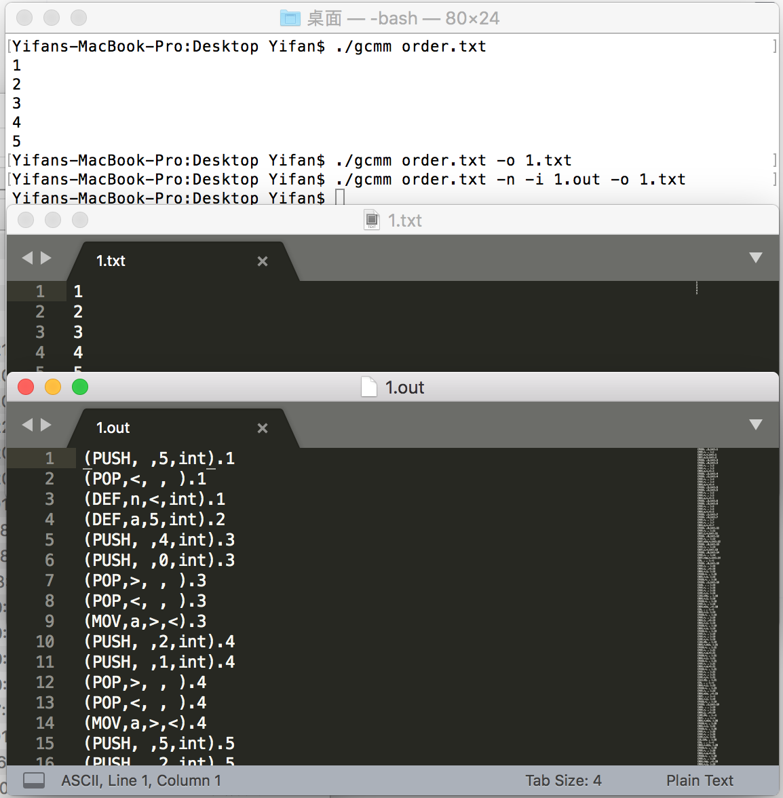

# 解释器构造实践 2017 团队文档

第55组 Cirno Team

组员：

- Xiyu Huang
- Yifan Cui
- Zhongtao Miao

GitHub项目主页：
https://github.com/yifanc62/CMMCompiler

## 小组特色

- 实现了for循环
- 实现了break跳出最近的循环
- 自定义指令集和自定义虚拟机
- 指令集中间代码优化
- 命令行程序编译参数
- 跨平台的GUI编辑器
- 关键字、常量和注释高亮

## 总体概要

本次解释器课程要求编写一个基于C语言的简略版CMM语言的解释器，可以解释运行输出运算结果。根据后期的情况变化，我们决定编写一个基于Java的CMM语言的编译器，生成线性的基于自定义指令集的指令，并在支持该指令集的自定义虚拟机上运行指令，最终输出结果。

程序运行的基本流程为：
1. 对输入的源码进行词法分析，返回一个Token流。
2. 对Token流进行语法分析，返回一个语法树根节点对象。
3. 对语法树根节点对象进行语义分析，在分析的同时根据语法结构生成中间代码。
4. 对生成的中间代码进行优化，滤去不必要的指令。
5. 使用虚拟机运行优化后的中间代码，若出现运行时错误，则输出错误信息，若正常则要求输入数字或输出运行结果。

## 详细说明

### 词法分析

词法分析使用一个类`Lexer`来完成，这个类接受一个`InputStream`作为输入，返回一个`TokenStream`作为结果。

`Lexer`类中构造了一个类似DFA的函数`next()`，用枚举类型`LexerStatus`规定了若干个不同的分析器状态，并根据下一个读入的字符进行状态转换。在回到初始状态的同时存储上一个识别完成的`Token`，并继续识别下一个，直至遇到文件尾部。

当词法分析器遇到错误时，会将无法识别的字符或是无法运算的数值等记录为一个错误类型的`Token`添加到流中，不会抛出异常中止分析。

### 语法分析

语法分析使用一个类`Parser`来完成，这个类接受一个`TokenStream`作为输入，返回一个`TreeNode`作为结果。

我们针对CMM语言构造了一个LL(1)文法，消除了所有的左递归并不会发生回溯。

`Parser`类使用了LL(1)算法生成语法树节点，并根据已经定义好的节点特征对每个节点添加子节点或是赋值。整个类中对于每种类型的语句或表达式均构造了一个`parse()`函数，用于生成这种类型的语句或表达式的树结点，并在需要分析子节点时继续调用，最后递归生成根节点返回。

当语法分析器遇到无法识别的错误时，会立即抛出一个`UnexpectedTokenException`异常，这种类型的异常会被立即捕捉并记录，并针对当前正在识别的语句或表达式的类型进行短语层错误恢复，以便继续分析。当语法分析器在未分析完成时遇到流的尾部，则会递归抛出`UnexpectedEOFException`异常，直到主分析函数捕捉后记录异常然后结束分析。

### 语义分析和中间代码生成

编译器使用一个类`Compiler`来完成，这个类接受一个`TreeNode`作为输入，返回一个`List<Command>`作为结果。

#### 自定义指令集

上文中提到的`Command`为自定义指令集的一条指令，编译器的运行结果为一个线性的指令列表，即中间代码。

我们针对CMM语言，仿照汇编语言和Java字节码自定义了一个指令集，每条指令以四元式的方式记录，可以将运行时的指令对象与字符串互相编解码，以便存储。指令类型包括跳转、取值、运算等，其详细说明可以参见虚拟机一节。

#### 语义分析

在编译器生成中间代码的过程同时会对变量类型以及变量名称进行简单的存储与查询，可以分辨明显的除0错误以及变量的定义、使用错误。例如变量重复定义或未定义的错误、赋值类型的错误、数组索引的错误等。

语义分析的错误结果会抛出`CompilerException`异常并立即捕捉、记录。

#### 中间代码生成

编译器会对每个树节点进行遍历，并根据定义好的节点类型和节点特征取每个节点的子节点生成该节点的指令并添加到父节点对应位置，同时调整跳转语句的地址，最终递归到主函数`compile()`，返回中间代码。

由于编译过程理应不会遇到错误，故中间代码生成的部分不会抛出异常，若发现有异常，均为编译器内部的逻辑错误。通过大量的测试发现没有这种现象产生。

值得一提的是，由于构造的LL(1)文法通过巧妙的方法消除了左递归，但是会导致同等级的运算符运算顺序从后向前。我们会通过判断运算符等级在编译时重新调整表达式语法树的结构再进行生成，保证运算顺序的正常。

### 中间代码优化

中间代码优化使用类`Optimizer`的静态函数`optimize()`来完成，这个函数接受一个`List<Command>`作为参数，返回优化后的`List<Command>`作为结果。

中间代码优化部分仅针对简单的几种情况进行了优化：
- 常数的运算指令
- 操作数进栈后立即出栈
- 代码块进入后立即退出
- 无条件跳转后不可达的指令

同时，在执行常数运算指令的优化时，会捕捉隐含的除0错误并立即捕捉、记录，最后将优化过程中的所有异常记录到编译器异常中。

### 代码运行和虚拟机

虚拟机使用一个类`Launcher`来完成，这个类接受一个`List<Command>`或一个`InputStream`作为输入，调用`launch()`输出运行结果，当输入为`InputStream`时，虚拟机会自动对输入字符串进行解码，获得指令对象。

`launch()`函数需要提供三个参数，一个`InputStream`和两个`OutputStream`，用于重定向标准输入流、标准输出流和错误输出流。

虚拟机拥有一个变量栈、一个变量表、两个操作数寄存器、一个比较寄存器和一个指令寄存器。

变量栈用于实现运算操作。由于寄存器只有两个，故在实现的时候没有考虑分配算法，而是简单的使用了栈结构进行运算。每个运算指令会取栈顶的两个值进行运算操作，并将运算结果入栈。

变量表用于实现存储操作。由于代码块的存在允许不同变量重名，故在变量表中实现了一个级联结构，在进入新代码块的时候生成子表，在退出代码块的时候返回父表。定义新变量时会定义在当前表，获取变量值时会进行级联搜索，直至搜索到最近层的变量值。

操作数寄存器用于保存当前运算的临时变量以及比较器的直接值，其实类似的操作完全可以用变量栈实现，但是没有进行优化。

比较寄存器用于保存比较结果，用于下一步的跳转操作。

指令寄存器用于记录下一个执行的指令地址，跳转操作通过修改指令寄存器的值来更改程序运行状态。每条非跳转指令执行晚会，指令寄存器会自加1。

定义的指令集可以参加如下代码：

```
public enum CommandType {
    //register: '<'->eax '>'->ebx
    //type: 'int'->int 'double'->double
    //address: int
    //name: String
    //length: int
    //value: int/double
    CMP, //(cmp, register, register, null) 比较操作
    JMP, //(jmp, address, null, null) 无条件跳转
    JE,  //(je, address, null, null) 相等跳转
    JNE, //(jne, address, null, null) 不等跳转
    JG,  //(jg, address, null, null) 大于跳转
    JGE, //(jge, address, null, null) 大于等于跳转
    JL,  //(jl, address, null, null) 小于跳转
    JLE, //(jle, address, null, null) 小于等于跳转
    DEF, //(def, name, register, type)/... 变量定义
    MOV, //(mov, name, null, register)/... 变量赋值或取值
    IN,  //(in, null, null, null) 进入代码块
    OUT, //(out, null, null, null) 退出代码块
    PUSH,//(push, null, value, type)/... 操作数入栈
    POP, //(pop, register, null, null) 操作数出栈
    ADD, //(add, null, null, null) 加
    SUB, //(sub, null, null, null) 减
    MUL, //(mul, null, null, null) 乘
    DIV, //(div, null, null, null) 除
    MOD, //(mod, null, null, null) 模
    SC,  //(sc, register, null, null) 输入
    PR,  //(pr, register, null, null) 输出
    EXIT //(exit, null, null, null) 退出
}
```

### 图形化界面

图形化界面使用了eclipse的swt框架实现，可以实现稳定的跨平台操作。

界面使用了一个表式布局，避免了绝对定位，确保了对于不同的窗口大小，控件显示正常。

菜单栏中添加了不同的操作，对于每个菜单项添加了监听器执行不同的操作。

语法高亮部分，每当输入框侦测到修改时，会立即调用上色的监听器，对整个部分重新进行词法分析和语法分析，并根据获得的对应token在字符串中的位置与其种类进行上色，并在语法分析的错误token下方添加下划线标示错误。

另外，图形化部分实现了文件的读取和保存，同时支持将中间代码部分保存到一个out文件并在界面里直接执行。

在启动程序时，如果指定了运行参数，则会转为命令行程序执行，运行参数如下：

`gcmm file [-n] [-o out_o] [-i out_i]`

参数 | 含义
---|---
-n | 不执行中间代码优化
-o | 保存输出结果至out_o
-i | 保存中间代码至out_i

## 运行截图






